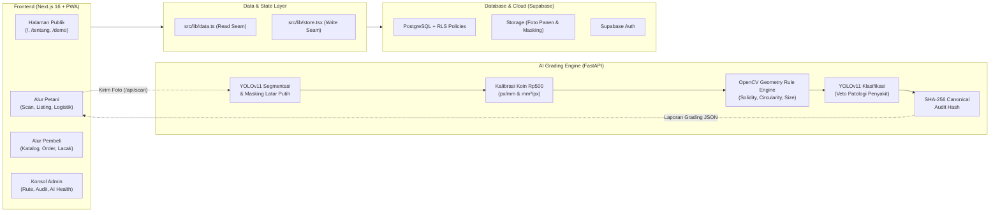

# 🌱 PANTAS — Setiap Panen Pantas Dihargai

<div align="center">

[](https://nextjs.org/)
[](https://react.dev/)
[](https://tailwindcss.com/)
[](https://fastapi.tiangolo.com/)
[](https://ultralytics.com/)
[](https://supabase.com/)
[](https://www.typescriptlang.org/)

**Platform Sistem Sortasi Mutu Cerdas Berbasis Computer Vision & Marketplace Hortikultura Terintegrasi**

[🌐 Kunjungi Aplikasi Live](https://pantas-ai.vercel.app) · [📖 Baca PRD Lengkap](docs/PRD.md) · [🧠 Whitepaper AI Engine](docs/AI.md) · [📊 Backlog & Status Fitur](docs/BACKLOG.md)

</div>

---

## 📌 Latar Belakang & Masalah

Rantai pasok hortikultura Indonesia kehilangan nilai di titik yang sama berulang kali: **momen penilaian mutu di pinggir sawah**.
1. **Mutu Dinilai dengan Mata Telanjang:** Tengkulak menaksir grade secara subjektif tanpa alat ukur objektif. Petani tidak memiliki dasar bantah, kehilangan 30–40% margin potensial.
2. **Asimetri Informasi Harga:** Petani tidak memiliki akses terhadap harga acuan pasar dan korelasi kuantitatif terhadap mutunya.
3. **Pangan Terbuang (*Food Loss*):** Kajian Bappenas & WRI (2021) mencatat **62,8%** pasokan sayuran domestik hilang sebelum sampai ke konsumen, menimbulkan kerugian ekonomi nasional **Rp106–205 triliun/tahun**.
4. **Logistik Terfragmentasi:** Pengiriman skala kecil mandiri memboroskan BBM dan merusak kesegaran produk tanpa kontrol rantai dingin.
5. **Klaim Mutu Tak Dapat Diaudit:** Pembeli industri kesulitan memverifikasi kualitas panen tanpa sortir ulang di gudang.

---

## 💡 Solusi: PANTAS

**PANTAS** mengubah penaksiran mutu hasil panen menjadi **pengukuran objektif berbasis computer vision yang dapat diaudit secara kriptografis**:

- 📸 **Pindai 1 Foto dengan Koin Rp500:** Menggunakan koin Rp500 (Ø 27 mm) sebagai referensi metrik fisik nyata untuk mengukur diameter (mm), luas (mm²), dan kebundaran (*circularity*).
- 🧠 **Dual-Stage YOLOv11 & OpenCV Rule Engine:** Segmentasi poligon YOLO-1 memisahkan objek dari latar belakang (*auto-masking*), Rule Engine OpenCV menghitung geometri, dan Klasifikasi YOLO-2 melakukan *veto* patologi penyakit/pembusukan.
- 📜 **Laporan Mutu Terverifikasi & Hash SHA-256:** Hasil grading menerbitkan laporan komposisi Grade A/B/C/REJECT dengan alasan yang transparan dan *audit hash* SHA-256 yang tercetak pada sertifikat publik ber-QR (`/lacak/[hash]`).
- ⚖️ **Rekomendasi Harga Adil:** Formulasi harga otomatis berbasis mutu dan harga acuan pasar PIHPS Bank Indonesia.
- 🚛 **Konsolidasi Logistik & Rantai Dingin:** Perencana rute penjemputan multi-petani terdekat untuk memangkas ongkos angkut dan checklist kepatuhan suhu dingin.
- 🌿 **Dashboard Dampak Berkelanjutan:** Menghitung kilogram pangan terselamatkan dan estimasi emisi CO₂e yang dicegah berdasarkan penelitian Poore & Nemecek (*Science*, 2018).

---

## 🏛️ Arsitektur Sistem



---

## 🏆 Konteks Kompetisi

- **Ajang:** **HOLOGY 9.0 (House of Technology)** — Cabang Lomba **HoloDev** (*Software Development Competition*)
- **Penyelenggara:** Fakultas Ilmu Komputer, Universitas Brawijaya (FILKOM UB)
- **Tema Besar:** *"Bloom Beyond: Where Ideas Take Root and Reach Further"*
- **Subtema:** **Ketahanan Pangan dan Pertanian Cerdas** (*Smart Agriculture and Food Security*)
- **Tim Pengembang:** **Inilah 4 trio** (Universitas Gadjah Mada)

---

## 👥 Tim Pengembang — **Inilah 4 trio**

Semua anggota merupakan mahasiswa aktif **Universitas Gadjah Mada (UGM)**:

| Anggota Tim | NIM | Peran | Tanggung Jawab Utama |
| :--- | :--- | :--- | :--- |
| **Muhammad Choirudin Ammar** | `25/556251/TK/62735` | **AI Engineer** | Arsitektur Dual-Stage YOLOv11, kurasi dataset & auto-masking latar putih, OpenCV geometry rule engine, kalibrasi skala koin Rp500, gerbang plausibilitas biologis, dan set regresi otomatis (`pytest`). |
| **Muhammad Raihan Surya** | `25/560713/TK/63338` | **Fullstack Developer (Lead)** | Aplikasi web Next.js 16 end-to-end, Supabase RLS & skema PostgreSQL (18 migrasi), rancangan arsitektur seam data (`data.ts`/`store.tsx`), design system Panen v2, dan integrasi API. |
| **Ahmad Rafi Firdaus** | `25/560526/TK/63314` | **Product Ideation & Strategist** | Perumusan ide dan tesis produk, riset Food Loss & Waste (FLW), pemetaan keselarasan subtema HOLOGY 9.0, user journey petani & pembeli, formulasi harga adil, dan analisis dampak ekonomi. |

---

## ⚡ Panduan Menjalankan Aplikasi

### 1. Siapkan dependency
```bash
cd web
npm install
cd ../ai_engine
python -m venv .venv
source .venv/bin/activate  # Di Windows: .venv\Scripts\activate
pip install -r requirements-dev.txt
```

### 2. Jalankan seluruh stack dari root
```bash
cd ..
npm run dev
```

Perintah tersebut menyalakan frontend di `http://localhost:3000` dan grading engine di `http://localhost:7860`, lalu mengarahkan frontend ke engine lokal secara otomatis. Menghentikan perintah juga menghentikan kedua service. Swagger UI tersedia di `http://localhost:7860/docs`.

Deployment grading engine menerima origin browser tambahan melalui `PANTAS_ALLOWED_ORIGINS` (daftar URL yang dipisahkan koma). Origin lokal dan deployment PANTAS utama sudah diizinkan secara bawaan.

Untuk verifikasi otomatis:

```bash
npm test             # unit test frontend
npm run test:e2e     # FastAPI + Next.js + Chromium
npm run check:health -- --url https://pantas-ai.vercel.app
```

### 3. Akun Uji Coba (Demo Mode)
Gunakan akun uji coba berikut atau klik tombol **1-Tap Login** di halaman `/demo`:
- **Akun Petani:** `petani@demo.pantas.id` (Sandi: `demo1234`)
- **Akun Pembeli Industri:** `pembeli@demo.pantas.id` (Sandi: `demo1234`)
- **Akun Koperasi / Admin:** `admin@demo.pantas.id` (Sandi: `demo1234`)

---

## 📚 Tautan Dokumentasi Terkait

- [📑 Master PRD (Product Requirements Document)](docs/PRD.md)
- [🧠 Whitepaper AI Engine & Model Card](docs/AI.md)
- [🗄️ Dokumentasi Arsitektur Backend & Database](docs/BACKEND.md)
- [📊 Backlog & Status 72 Fitur F-ID](docs/BACKLOG.md)
- [🔍 Analisis Kesenjangan (Gap Analysis)](docs/GAP_ANALYSIS.md)
- [🎤 Panduan Materi & Slide Pitch Deck](docs/MATERI_PRESENTASI.md)

---

<div align="center">
  <sub>Dibangun dengan dedikasi untuk memajukan kesejahteraan petani dan ketahanan pangan Indonesia 🇮🇩</sub><br>
  <sub>© 2026 <b>Inilah 4 trio</b> · Universitas Gadjah Mada</sub>
</div>
