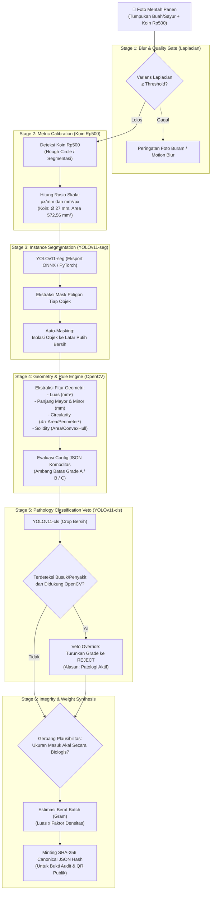

# 🧠 PANTAS AI Engine — Technical Whitepaper & Model Card

> **Sistem Sortasi Mutu Cerdas Berbasis Dual-Stage Computer Vision & Kalibrasi Metrik Fisik**  
> **Komponen:** `ai_engine/` (FastAPI + YOLOv11 + OpenCV)  
> **Tim Pengembang:** Inilah 4 trio (Universitas Gadjah Mada)  
> **Ajang:** HOLOGY 9.0 HoloDev — *Ketahanan Pangan dan Pertanian Cerdas*  

---

## 1. Ringkasan Eksekutif

Dalam rantai pasok hortikultura tradisional di Indonesia, penaksiran mutu (*grading*) panen dilakukan secara subjektif dengan mata telanjang di pinggir kebun. Hal ini memicu asimetri informasi: tengkulak menekan harga petani, *food loss* membengkak (62,8% sayuran terbuang), dan komoditas cacat ringan tidak terserap ke industri hilir.

**PANTAS AI Engine** mengubah penilaian mutu menjadi **pengukuran kuantitatif, transparan, dan dapat diaudit secara kriptografis**. Dengan hanya satu foto panen di atas permukaan datar bersama koin Rp500 sebagai referensi ukuran, engine menghasilkan komposisi grade batch (A/B/C/REJECT), pengukuran luas/panjang per objek terkalibrasi milimeter, estimasi berat, deteksi patologi, dan *audit hash* SHA-256 yang independen.

---

## 2. Arsitektur Pipeline 6-Tahap (6-Stage Pipeline)



---

## 3. Detail Komponen & Metodologi

### 3.1 Kalibrasi Metrik Koin Fisik (Physical Coin Calibration)
- **Objek Referensi:** Koin logam pecahan Rp500 emisi Bank Indonesia (Aluminium, Diameter = 27,0 mm, Luas = 572,56 mm²).
- **Algoritma:** OpenCV HoughCircles dikombinasikan dengan deteksi tepi Canny dan verifikasi kebundaran (*circularity* > 0,88).
- **Output:** Nilai `px_per_mm` dan `mm2_per_px` dinamis per citra, memungkinkan konversi piksel ke satuan metrik internasional (SI) tanpa memerlukan alat ukur eksternal mahal.

### 3.2 Isolasi Latar Belakang (*Auto-Masking*)
- Model segmentasi YOLO-1 menghasilkan mask biner presisi per objek.
- Latar belakang luar objek dibersihkan menjadi kanvas putih murni (`RGB: 255, 255, 255`).
- **Keunggulan:** Menghilangkan 100% gangguan lingkungan (bayangan daun, permukaan tanah, meja kayu, warna jari tangan) sehingga model klasifikasi penyakit (YOLO-2) tidak mengalami *background shortcut learning*.

### 3.3 Mesin Aturan Berbasis Geometri (*OpenCV Rule Engine*)
Keputusan grade tidak dibiarkan sebagai kotak hitam (*black-box*), melainkan dievaluasi terhadap aturan agronomi transparan pada `ai_engine/grading_configs/*.json`:
- **Circularity:** $C = \frac{4 \pi \cdot \text{Area}}{\text{Perimeter}^2}$ (Mendeteksi kesempurnaan bentuk bulat tomat/cabai).
- **Solidity:** $S = \frac{\text{Area}}{\text{ConvexHull Area}}$ (Mendeteksi lekukan tidak normal atau kecacatan fisik).
- **Rasio Aspek:** $AR = \frac{\text{Major Axis}}{\text{Minor Axis}}$ (Mendeteksi kelurusan cabai atau timun).

### 3.4 Gerbang Plausibilitas Skala (*Plausibility Gate*)
Untuk mencegah kesalahan kalibrasi (misalnya koin tertutup sebagian sehingga terdeteksi terlalu kecil dan membuat buah tampak raksasa):
- Memeriksa batas dimensi fisik biologis komoditas (misal: panjang cabai harus antara 20–250 mm).
- Jika rasio ukuran tidak masuk akal, engine secara aman menolak mode metrik dan menggunakan mode fallback rasio proporsional visual.

### 3.5 Integritas & Ketelusuran (*Cryptographic Audit Hash*)
Setiap hasil inferensi diserialisasi ke dalam format JSON kanonik (key terurut, angka dinormalisasi) dan di-hash menggunakan **SHA-256**:
$$\text{Audit Hash} = \text{SHA-256}(\text{CanonicalJSON}(\text{GradingResult}))$$
Hash ini dicetak ke sertifikat digital dan QR Code pada halaman publik `/lacak/[hash]`, menjamin bahwa laporan grading tidak dapat dimanipulasi oleh petani maupun pembeli setelah diterbitkan.

---

## 4. Kartu Rapor Akurasi Model (Model Evaluation Card)

### 4.1 YOLOv11-seg (Instance Segmentation & Masking)

| Komoditas | Precision | Recall | mAP@50 (Mask) | mAP@50-95 (Mask) | Status Evaluasi |
| :--- | :--- | :--- | :--- | :--- | :--- |
| **Cabai (Chili)** | 97,8% | 94,5% | **97,4%** | 78,2% | Optimal (Model Spesialis) ✅ |
| **Timun (Cucumber)** | 95,9% | 89,8% | **96,0%** | 81,4% | Optimal (Model Spesialis) ✅ |
| **Tomat (Tomato)** | 94,5% | 84,5% | **90,3%** | 74,6% | Optimal (Model Spesialis) ✅ |
| **Wortel (Carrot)** | 91,1% | 78,1% | **87,4%** | 69,8% | Optimal (Model Spesialis) ✅ |

### 4.2 YOLOv11-cls (Pathology Veto Classifier)

| Komoditas | Akurasi Validasi | F1-Score | Kelas Deteksi | Catatan Kejujuran Metodologis |
| :--- | :--- | :--- | :--- | :--- |
| **Cabai (Chili)** | 81,3% | 81,2% | Sehat vs Busuk / Antraknosa | Set validasi 16 potongan crop; veto aktif terkoreksi. |
| **Tomat (Tomato)** | 97,5% | 97,5% | Sehat vs Busuk / Bercak Daun | Stabil pada dataset auto-masking latar putih. |
| **Timun (Cucumber)** | 98,2% | 98,2% | Sehat vs Busuk / Embun Bulu | Sangat stabil & teruji. |
| **Wortel (Carrot)** | 100,0%* | 100,0%* | Sehat vs Busuk / Cacat Fisik | *Catatan transparansi: evaluasi split per potongan objek. |

---

## 5. Spesifikasi Endpoint API (FastAPI)

### `POST /predict`
Menerima berkas gambar multipart dan parameter nama komoditas.

**Request:**
- `file`: `UploadFile` (Format JPG/PNG)
- `commodity`: `string` (`tomato_sayur`, `tomato_buah`, `chili_keriting`, `chili_rawit`, `cucumber`, `carrot`)

**Response Schema (JSON):**
```json
{
  "status": "success",
  "komoditas": "tomato_sayur",
  "waktu_inferensi_ms": 342,
  "kalibrasi": {
    "valid": true,
    "px_per_mm": 14.28,
    "diameter_koin_px": 385.6,
    "catatan": "Koin Rp500 terdeteksi sempurna"
  },
  "komposisi": {
    "A": 0.65,
    "B": 0.25,
    "C": 0.10,
    "REJECT": 0.00
  },
  "total_objek": 20,
  "estimasi_berat_kg": 1.45,
  "objek": [
    {
      "id": 1,
      "grade": "A",
      "alasan": "Bentuk bulat simetris (circularity 0.94), diameter 58.2 mm memenuhi standar Grade A",
      "panjang_mm": 58.2,
      "luas_mm2": 2660.4,
      "veto_patologi": "sehat",
      "confidence": 0.96
    }
  ],
  "hash_audit": "9f83c18b76c8d2089f2a0b12759e69c4e2098b6714081c2f1f58b093f18a2456"
}
```

---

## 6. Uji Otomatis & Regresi (`pytest`)

Untuk menjaga stabilitas model saat aturan JSON diperbarui:
```bash
# Menjalankan set regresi otomatis
cd ai_engine
pytest test_regresi_grading.py -v
pytest test_unit_plausibilitas.py -v
```
Pengujian ini memastikan tidak ada pergeseran output grade di atas ambang toleransi $\pm 0.10$ pada kumpulan gambar sampel uji baseline.
