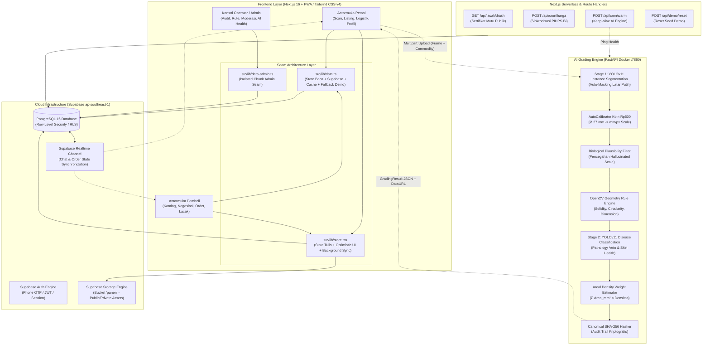
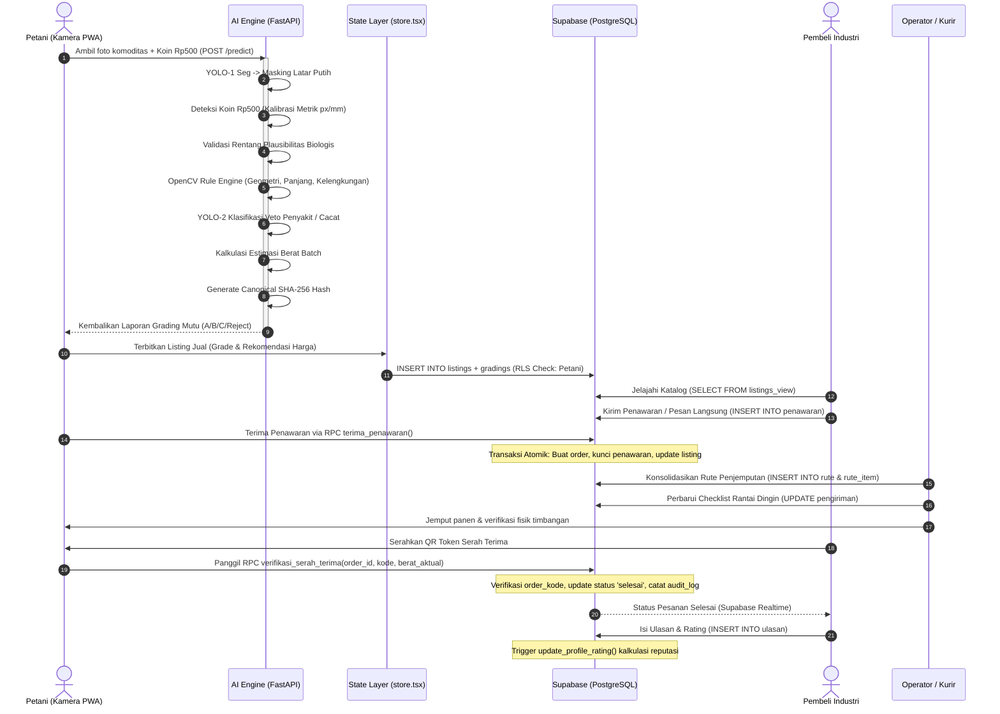

# 📘 Dokumen Pendukung Teknis PANTAS
### *Platform Sistem Sortasi Mutu Cerdas Berbasis Computer Vision & Marketplace Hortikultura Terintegrasi*

---

## 1. Ringkasan Eksekutif & Arsitektur Sistem

PANTAS mengintegrasikan sistem computer vision dua tahap (*dual-stage*) di sisi edge/inferensi dengan platform *marketplace* dan logistik berbasis cloud yang tangguh (*offline-first PWA*).

### 1.1 Diagram Arsitektur Tingkat Tinggi (High-Level Architecture)



### 1.2 Alur Data End-to-End (Data Flow Pipeline)



---

## 2. Entity Relationship Diagram (ERD) Mendalam

PANTAS mengadopsi arsitektur basis data relasional **PostgreSQL 15** yang dienkapsulasi penuh dengan kebijakan **Row Level Security (RLS)** dan fungsi *Security Definer*.

### 2.1 Diagram Visual Relasi Antar Entitas (Comprehensive ERD)

```mermaid
erDiagram
    %% Hubungan Utama Pengguna
    PROFILES ||--o{ GRADINGS : "melakukan inspeksi"
    PROFILES ||--o{ LISTINGS : "menerbitkan komoditas"
    PROFILES ||--o{ ORDERS : "sebagai pembeli"
    PROFILES ||--o{ ORDERS : "sebagai petani"
    PROFILES ||--o{ PENAWARAN : "mengajukan (pembeli)"
    PROFILES ||--o{ PENAWARAN : "menerima (petani)"
    PROFILES ||--o{ PESAN : "mengirim pesan"
    PROFILES ||--o{ PESAN : "menerima pesan"
    PROFILES ||--o{ NOTIFIKASI : "menerima notifikasi"
    PROFILES ||--o{ ULASAN : "memberikan ulasan (penilai)"
    PROFILES ||--o{ ULASAN : "menerima ulasan (dinilai)"
    PROFILES ||--o{ RUTE : "dikelola oleh operator"
    PROFILES ||--o{ AUDIT_LOG : "memicu aksi"

    %% Hubungan Grading & Listing
    GRADINGS ||--o| LISTINGS : "menjadi dasar mutu"

    %% Hubungan Listing, Penawaran, dan Pesanan
    LISTINGS ||--o{ PENAWARAN : "menjadi objek negosiasi"
    LISTINGS ||--o{ ORDERS : "dikonversi menjadi pesanan"
    PENAWARAN ||--o| PENAWARAN : "induk tawar-menawar (counter-offer)"
    PENAWARAN ||--o| ORDERS : "melahirkan pesanan (order_id)"

    %% Hubungan Siklus Pesanan & Keamanan
    ORDERS ||--|| ORDER_KODE : "diproteksi token verifikasi"
    ORDERS ||--o{ PESANAN_RIWAYAT : "merekam jejak status"
    ORDERS ||--o| PENGIRIMAN : "memiliki jadwal pengiriman"
    ORDERS ||--o{ ULASAN : "memiliki evaluasi transaksi"

    %% Hubungan Logistik & Konsolidasi Rute
    PENGIRIMAN ||--o{ RUTE_ITEM : "terjadwal pada waypoint"
    RUTE ||--o{ RUTE_ITEM : "mengonsolidasi pengiriman"

    %% Definisi Entitas & Atribut
    PROFILES {
        uuid id PK "auth.users FK"
        text peran "petani | pembeli | admin"
        text nama "Nama lengkap pengguna"
        text phone "Nomor telepon / WhatsApp"
        text lokasi "Kabupaten / Kota domisili"
        text alamat "Alamat lengkap titik jemput/antar"
        double_precision lat "Koordinat latitude GPS"
        double_precision lng "Koordinat longitude GPS"
        numeric rating "Rata-rata bintang ulasan (1.0 - 5.0)"
        integer transaksi "Total pesanan selesai"
        boolean is_demo "Penanda akun simulasi demo"
        boolean tur_selesai "Status penyelesaian panduan PWA"
        timestamptz created_at "Waktu registrasi akun"
    }

    GRADINGS {
        uuid id PK "gen_random_uuid()"
        uuid petani_id FK "profiles.id"
        text komoditas "Kode komoditas (mis. tomato)"
        text komoditas_label "Label tampilan (mis. Tomat Sayur)"
        text grade_dominan "A | B | C | REJECT"
        integer objek_terdeteksi "Total butir buah terdeteksi"
        jsonb hasil "Payload lengkap kalkulasi AI & geometri"
        text hash_audit UK "SHA-256 canonical hash sertifikat"
        text gambar_url "URL foto panen di Storage panen"
        boolean publik "Izin tampil di /lacak/:hash"
        timestamptz created_at "Waktu pemindaian"
    }

    LISTINGS {
        text id PK "Format: PNT-L-xxxx"
        uuid petani_id FK "profiles.id"
        uuid grading_id FK "gradings.id (nullable)"
        text nama "Judul penawaran komoditas"
        text komoditas "Kode komoditas"
        text grade "Grade mutu yang ditawarkan"
        numeric berat_kg "Total kuantitas awal (kg)"
        numeric stok_kg "Sisa kuantitas yang belum terikat pesanan"
        integer harga_per_kg "Harga penawaran (IDR/kg)"
        text gambar "URL foto katalog utama"
        text satuan "Satuan jual (default: kg)"
        text status "tayang | habis | ditutup | dimoderasi"
        jsonb komposisi "Persentase grade per butir"
        text catatan_ai "Rangkuman analisa visual AI"
        timestamptz created_at "Waktu listing dipublikasikan"
    }

    PENAWARAN {
        uuid id PK "gen_random_uuid()"
        text listing_id FK "listings.id"
        uuid pembeli_id FK "profiles.id"
        uuid petani_id FK "profiles.id"
        numeric kuantitas_kg "Volume komoditas yang ditawar"
        integer harga_per_kg "Harga yang diajukan (IDR/kg)"
        date tanggal_ambil "Ekspektasi waktu penjemputan"
        text catatan "Pesan negosiasi"
        text status "terkirim | ditawar_balik | diterima | ditolak | kedaluwarsa"
        uuid induk_id FK "penawaran.id (rantai tawar)"
        text order_id FK "orders.id (terisi saat diterima)"
        timestamptz kedaluwarsa_pada "Batas waktu respon (48 jam)"
        timestamptz created_at "Waktu penawaran diajukan"
    }

    ORDERS {
        text id PK "Format: PNT-ORD-xxxx"
        text listing_id FK "listings.id"
        uuid pembeli_id FK "profiles.id"
        uuid petani_id FK "profiles.id"
        text nama "Ringkasan nama komoditas & grade"
        numeric berat_kg "Kuantitas pesanan awal (kg)"
        numeric berat_aktual_kg "Berat riil timbangan serah terima"
        integer harga_per_kg "Harga per kg yang disepakati (IDR)"
        integer total "Total nominal transaksi (IDR)"
        text status "dipesan | dikonfirmasi | siap_diambil | selesai | dibatalkan"
        text status_kasus "normal | pembatalan_diajukan | dibatalkan | sengketa"
        text alasan_kasus "Keterangan pembatalan/sengketa"
        uuid diminta_oleh FK "profiles.id"
        uuid ditanggapi_oleh FK "profiles.id"
        text status_pembayaran "belum_dibayar | ditandai_dibayar | dikonfirmasi"
        text catatan_mutu "Catatan verifikasi mutu di lokasi"
        timestamptz created_at "Waktu pemesanan"
    }

    ORDER_KODE {
        text order_id PK, FK "orders.id (1:1 relationship)"
        text kode "Token 6-karakter rahasia serah terima"
        timestamptz dipakai_pada "Waktu pencocokan token"
    }

    PESANAN_RIWAYAT {
        bigserial id PK "Auto-increment ID"
        text order_id FK "orders.id"
        text status "Status transaksi pada checkpoint"
        uuid oleh FK "profiles.id (Aktor pengubah)"
        text catatan "Keterangan transisi"
        timestamptz created_at "Waktu perubahan status"
    }

    PENGIRIMAN {
        uuid id PK "gen_random_uuid()"
        text order_id FK "orders.id"
        text metode "jemput_mandiri | konsolidasi | kurir_mitra"
        timestamptz jendela_mulai "Estimasi awal kedatangan"
        timestamptz jendela_selesai "Estimasi akhir kedatangan"
        text alamat_jemput "Alamat fisik gudang/kebun"
        double_precision lat "Koordinat latitude jemput"
        double_precision lng "Koordinat longitude jemput"
        text status "dijadwalkan | dijemput | dalam_perjalanan | tiba | diterima | batal"
        jsonb checklist "Inspeksi suhu & ventilasi rantai dingin"
        integer ongkos_estimasi "Estimasi tarif logistik (IDR)"
        timestamptz created_at "Waktu pembuatan manifest"
    }

    RUTE {
        uuid id PK "gen_random_uuid()"
        date tanggal "Tanggal operasional rute"
        text kendaraan "Spesifikasi armada logistik"
        numeric kapasitas_kg "Kapasitas muat maksimal (kg)"
        text status "draf | terkunci | berjalan | selesai"
        numeric jarak_km "Total jarak tempuh konsolidasi (km)"
        numeric jarak_individual_km "Jarak bila dijemput sendiri-sendiri"
        uuid dibuat_oleh FK "profiles.id (Operator)"
        timestamptz created_at "Waktu perencanaan rute"
    }

    RUTE_ITEM {
        uuid rute_id PK, FK "rute.id"
        uuid pengiriman_id PK, FK "pengiriman.id"
        integer urutan "Urutan urutan perhentian (waypoint)"
    }

    PESAN {
        uuid id PK "gen_random_uuid()"
        text order_id FK "orders.id (nullable)"
        uuid penawaran_id FK "penawaran.id (nullable)"
        uuid pengirim_id FK "profiles.id"
        uuid penerima_id FK "profiles.id"
        text isi "Konten pesan teks"
        boolean dibaca "Status centang baca"
        timestamptz created_at "Waktu kirim pesan"
    }

    NOTIFIKASI {
        bigserial id PK "Auto-increment ID"
        uuid user_id FK "profiles.id"
        text jenis "penawaran | pesanan | rute | sistem"
        text judul "Judul ringkas pemberitahuan"
        text isi "Detail isi notifikasi"
        text tautan "Deep-link ke rute aplikasi"
        timestamptz dibaca_pada "Waktu pengguna membuka notifikasi"
        timestamptz created_at "Waktu pembuatan notifikasi"
    }

    ULASAN {
        uuid id PK "gen_random_uuid()"
        text order_id FK "orders.id"
        uuid penilai_id FK "profiles.id"
        uuid dinilai_id FK "profiles.id"
        integer bintang "Skala nilai integritas (1 s.d. 5)"
        text komentar "Ulasan kualitatif transaksi"
        timestamptz created_at "Waktu ulasan dibuat"
    }

    AUDIT_LOG {
        bigserial id PK "Auto-increment ID"
        uuid aktor_id FK "profiles.id (Nullable untuk trigger sistem)"
        text aksi "Event (mis. pesanan.status, listing.moderasi)"
        text entitas "Tabel target (orders, listings, gradings)"
        text entitas_id "Primary key entitas target"
        jsonb meta "Payload perubahan state (sebelum/sesudah)"
        timestamptz created_at "Waktu pencatatan mutlak"
    }

    HARGA_ACUAN {
        text komoditas PK "Kode unik komoditas"
        integer harga "Harga acuan pasar (IDR/kg)"
        text sumber "PIHPS Bank Indonesia / Bapanas"
        date tanggal "Tanggal data harga acuan"
        timestamptz updated_at "Waktu sinkronisasi terakhir"
    }

    EMISI_FAKTOR {
        text komoditas PK "Kode unik komoditas"
        numeric faktor "Faktor emisi kg CO2e per kg panen"
        text sumber "Rujukan ilmiah (Poore & Nemecek 2018)"
        text catatan "Metodologi & batasan perhitungan"
    }
```



---

## 3. Kamus Data (Data Dictionary)

Berikut adalah rincian struktur kolom, aturan batasan (*constraints*), dan indeks performa untuk setiap tabel dalam basis data PANTAS:

### 3.1 Tabel `profiles`
Menyimpan identitas terotentikasi yang terhubung 1:1 dengan `auth.users` Supabase.

| Nama Kolom | Tipe Data | Nullable | Default / Constraints | Deskripsi Bisnis |
| :--- | :--- | :---: | :--- | :--- |
| `id` | `uuid` | NO | `PK`, `REFERENCES auth.users(id) ON DELETE CASCADE` | ID identitas unik pengguna dari Supabase Auth. |
| `peran` | `text` | NO | `CHECK (peran IN ('petani', 'pembeli', 'admin'))` | Peran hak akses otorisasi dalam sistem. |
| `nama` | `text` | NO | - | Nama lengkap petani, perwakilan pembeli, atau admin. |
| `phone` | `text` | YES | - | Nomor WhatsApp aktif untuk konfirmasi manual. |
| `lokasi` | `text` | YES | - | Nama distrik/kabupaten (mis. "Sleman, DIY"). |
| `alamat` | `text` | YES | - | Alamat jalan detail untuk penjemputan/pengantaran. |
| `lat` | `double precision` | YES | - | Titik garis lintang GPS koordinat gudang/kebun. |
| `lng` | `double precision` | YES | - | Titik garis bujur GPS koordinat gudang/kebun. |
| `rating` | `numeric(2,1)` | NO | `DEFAULT 5.0` | Nilai reputasi terakumulasi dari tabel `ulasan`. |
| `transaksi` | `integer` | NO | `DEFAULT 0` | Jumlah order yang berhasil diselesaikan (`selesai`). |
| `is_demo` | `boolean` | NO | `DEFAULT false` | Flag penanda akun demo (dikecualikan dari analitik dampak riil). |
| `tur_selesai` | `boolean` | NO | `DEFAULT false` | Menandai apakah pengguna telah menyelesaikan onboarding tour. |
| `created_at` | `timestamptz`| NO | `DEFAULT now()` | Waktu profil pertama kali diinisialisasi. |

*Indeks*: `CREATE INDEX idx_profiles_peran ON profiles(peran);`

---

### 3.2 Tabel `gradings`
Menyimpan hasil audit komputasi visi dan sertifikat inspeksi mutu AI yang tidak dapat dimanipulasi (*immutable*).

| Nama Kolom | Tipe Data | Nullable | Default / Constraints | Deskripsi Bisnis |
| :--- | :--- | :---: | :--- | :--- |
| `id` | `uuid` | NO | `PK`, `DEFAULT gen_random_uuid()` | Pengenal unik inspeksi grading. |
| `petani_id` | `uuid` | NO | `REFERENCES profiles(id) ON DELETE CASCADE` | Pemilik hasil panen yang melakukan pemindaian. |
| `komoditas` | `text` | NO | - | Kode komoditas (`tomato`, `chili`, `carrot`, `cucumber`). |
| `komoditas_label` | `text` | NO | - | Label teks manusiawi (mis. "Tomat Sayur"). |
| `grade_dominan` | `text` | NO | `CHECK (grade_dominan IN ('A', 'B', 'C', 'REJECT'))` | Grade mayoritas hasil penaksiran mesin aturan. |
| `objek_terdeteksi`| `integer` | NO | `DEFAULT 0` | Cacah butir komoditas yang berhasil disegmentasi. |
| `hasil` | `jsonb` | NO | - | Payload detail: dimensi fisik, kebundaran, cacat, bobot est. |
| `hash_audit` | `text` | YES | `UNIQUE` | Nilai hash kanonikal SHA-256 sertifikat grading. |
| `gambar_url` | `text` | YES | - | URL publik citra bertanda di storage `panen`. |
| `publik` | `boolean` | NO | `DEFAULT true` | Menentukan apakah grading dapat diakses via `/lacak/:hash`. |
| `created_at` | `timestamptz`| NO | `DEFAULT now()` | Timestamp eksekusi model inferensi. |

*Indeks*: `CREATE UNIQUE INDEX idx_gradings_hash_audit ON gradings(hash_audit);`

---

### 3.3 Tabel `listings`
Menyimpan penawaran komoditas panen petani ke marketplace publik.

| Nama Kolom | Tipe Data | Nullable | Default / Constraints | Deskripsi Bisnis |
| :--- | :--- | :---: | :--- | :--- |
| `id` | `text` | NO | `PK`, `DEFAULT 'PNT-L-' || lpad(nextval(...), 4, '0')` | ID tercetak listing (mis. `PNT-L-0412`). |
| `petani_id` | `uuid` | NO | `REFERENCES profiles(id) ON DELETE CASCADE` | Petani penjual pemilik komoditas. |
| `grading_id` | `uuid` | YES | `REFERENCES gradings(id) ON DELETE SET NULL` | Tautan ke sertifikat grading AI yang melandasinya. |
| `nama` | `text` | NO | - | Nama judul listing (mis. "Tomat Sayur Segar Grade A"). |
| `komoditas` | `text` | NO | - | Kategori komoditas. |
| `grade` | `text` | NO | `CHECK (grade IN ('A', 'B', 'C', 'REJECT'))` | Mutu produk yang diperjualbelikan. |
| `berat_kg` | `numeric` | NO | `CHECK (berat_kg > 0)` | Total kuantitas panen yang dipublikasikan (kg). |
| `stok_kg` | `numeric` | YES | - | Sisa kuantitas yang belum terikat pesanan. |
| `harga_per_kg` | `integer` | NO | `CHECK (harga_per_kg > 0)` | Harga jual satuan per kilogram (IDR). |
| `gambar` | `text` | NO | `DEFAULT '/img/tomat.jpg'` | URL foto cover listing. |
| `satuan` | `text` | YES | `DEFAULT 'kg'` | Satuan takaran penjualan. |
| `status` | `text` | NO | `CHECK (status IN ('tayang', 'habis', 'ditutup', 'dimoderasi'))` | Keadaan visibilitas di pasar. |
| `komposisi` | `jsonb` | YES | - | Snapshot sebaran mutu batch grading (mis. A: 80%, B: 20%). |
| `catatan_ai` | `text` | YES | - | Rekomendasi tekstual hasil inspeksi visual. |
| `created_at` | `timestamptz`| NO | `DEFAULT now()` | Waktu listing tayang. |

*Indeks*: `CREATE INDEX idx_listings_petani ON listings(petani_id);`, `CREATE INDEX idx_listings_status ON listings(status);`

---

### 3.4 Tabel `penawaran` (Negosiasi B2B)
Memfasilitasi siklus tawar-menawar harga dan volume panen secara formal sebelum menjadi pesanan mengikat.

| Nama Kolom | Tipe Data | Nullable | Default / Constraints | Deskripsi Bisnis |
| :--- | :--- | :---: | :--- | :--- |
| `id` | `uuid` | NO | `PK`, `DEFAULT gen_random_uuid()` | ID transaksi negosiasi. |
| `listing_id` | `text` | NO | `REFERENCES listings(id) ON DELETE CASCADE` | Listing panen yang sedang ditawar. |
| `pembeli_id` | `uuid` | NO | `REFERENCES profiles(id)` | Pihak pembeli yang mengajukan tawaran. |
| `petani_id` | `uuid` | NO | `REFERENCES profiles(id)` | Pihak petani penjual penerima tawaran. |
| `kuantitas_kg` | `numeric(10,2)` | NO | `CHECK (kuantitas_kg > 0)` | Volume panen yang diminati (kg). |
| `harga_per_kg` | `integer` | NO | `CHECK (harga_per_kg > 0)` | Nilai penawaran harga per kg (IDR). |
| `tanggal_ambil`| `date` | YES | - | Rencana tanggal pengambilan panen. |
| `catatan` | `text` | YES | - | Catatan negosiasi (opsional). |
| `status` | `text` | NO | `CHECK (status IN ('terkirim', 'ditawar_balik', 'diterima', 'ditolak', 'kedaluwarsa'))` | Status alur tawar-menawar. |
| `induk_id` | `uuid` | YES | `REFERENCES penawaran(id)` | Pointer ke penawaran sebelumnya bila ada tawaran balik. |
| `order_id` | `text` | YES | `REFERENCES orders(id) ON DELETE SET NULL` | ID pesanan yang terbit saat penawaran disepakati. |
| `kedaluwarsa_pada`| `timestamptz`| NO | `DEFAULT now() + interval '48 hours'` | Batas kedaluwarsa penawaran tanpa respon. |
| `created_at` | `timestamptz`| NO | `DEFAULT now()` | Waktu penawaran dikirimkan. |

*Indeks*: `CREATE INDEX idx_penawaran_aktor ON penawaran(petani_id, pembeli_id, status);`

---

### 3.5 Tabel `orders`
Menyimpan kontrak transaksi jual beli komoditas yang sah secara operasional.

| Nama Kolom | Tipe Data | Nullable | Default / Constraints | Deskripsi Bisnis |
| :--- | :--- | :---: | :--- | :--- |
| `id` | `text` | NO | `PK`, `DEFAULT 'PNT-ORD-' || lpad(...)` | ID faktur pesanan resmi (mis. `PNT-ORD-0104`). |
| `listing_id` | `text` | NO | `REFERENCES listings(id)` | Asal listing yang ditransaksikan. |
| `pembeli_id` | `uuid` | NO | `REFERENCES profiles(id)` | Aktor pembeli yang memesan. |
| `petani_id` | `uuid` | NO | `REFERENCES profiles(id)` | Aktor petani pemilik hasil bumi. |
| `nama` | `text` | NO | - | Ringkasan judul barang pesanan. |
| `berat_kg` | `numeric` | NO | `CHECK (berat_kg > 0)` | Kuantitas yang disepakati dalam kontrak (kg). |
| `berat_aktual_kg`| `numeric(10,2)`| YES | - | Berat riil hasil penimbangan saat serah terima fisik. |
| `harga_per_kg` | `integer` | NO | `CHECK (harga_per_kg > 0)` | Nilai harga per kg disepakati (IDR). |
| `total` | `integer` | NO | `CHECK (total > 0)` | Nilai total kewajiban bayar (IDR). |
| `status` | `text` | NO | `CHECK (status IN ('dipesan', 'dikonfirmasi', 'siap_diambil', 'selesai', 'dibatalkan'))` | Tahapan logistik & progres fisik komoditas. |
| `status_kasus` | `text` | NO | `CHECK (status_kasus IN ('normal', 'pembatalan_diajukan', 'dibatalkan', 'sengketa'))` | Status ortogonal penanganan kendala transaksi. |
| `alasan_kasus` | `text` | YES | `CHECK (alasan_kasus IS NULL OR length(...) BETWEEN 10 AND 500)` | Alasan komplain atau pengajuan pembatalan. |
| `diminta_oleh` | `uuid` | YES | `REFERENCES profiles(id)` | Pihak yang memicu pembatalan/sengketa. |
| `ditanggapi_oleh`| `uuid` | YES | `REFERENCES profiles(id)` | Pihak lawan yang menyetujui atau menolak kasus. |
| `status_pembayaran`| `text` | NO | `CHECK (status_pembayaran IN ('belum_dibayar', 'ditandai_dibayar', 'dikonfirmasi'))` | Status settlement dana tunai/transfer. |
| `catatan_mutu` | `text` | YES | - | Berita acara kondisi mutu barang di lokasi. |
| `created_at` | `timestamptz`| NO | `DEFAULT now()` | Waktu pesanan diterbitkan. |

---

### 3.6 Tabel `order_kode` (Zero-Leakage Security Token)
Menyimpan token rahasia serah terima yang dipisahkan dari tabel `orders` demi keamanan.

| Nama Kolom | Tipe Data | Nullable | Constraints | Deskripsi Bisnis |
| :--- | :--- | :---: | :--- | :--- |
| `order_id` | `text` | NO | `PK`, `REFERENCES orders(id) ON DELETE CASCADE` | Terhubung 1:1 ke pesanan terkait. |
| `kode` | `text` | NO | - | Token acak (mis. `KOD-8821`) yang dipegang pembeli. |
| `dipakai_pada` | `timestamptz`| YES | - | Timestamp verifikasi serah terima fisik berhasil. |

> **Catatan Keamanan (NFR-SEC-03):** Petani **TIDAK PERNAH** diberikan hak akses `SELECT` ke tabel ini. Petani memindai QR code pembeli dan mengirim token ke fungsi *Security Definer* `verifikasi_serah_terima` yang memverifikasi kecocokan di sisi database server.

---

### 3.7 Tabel Logistik & Konsolidasi Rute (`pengiriman`, `rute`, `rute_item`)

#### `pengiriman`
| Nama Kolom | Tipe Data | Constraints | Deskripsi |
| :--- | :--- | :--- | :--- |
| `id` | `uuid` | `PK`, `DEFAULT gen_random_uuid()` | Pengenal jadwal logistik. |
| `order_id` | `text` | `REFERENCES orders(id) ON DELETE CASCADE` | Pesanan yang diangkut. |
| `metode` | `text` | `CHECK (metode IN ('jemput_mandiri', 'konsolidasi', 'kurir_mitra'))` | Moda penjemputan barang. |
| `status` | `text` | `CHECK (status IN ('dijadwalkan', 'dijemput', 'dalam_perjalanan', 'tiba', 'diterima', 'batal'))` | Tracking armada. |
| `checklist` | `jsonb` | `DEFAULT '{}'::jsonb` | Kepatuhan rantai dingin: kebersihan box, ventilasi, suhu awal/akhir (°C). |
| `ongkos_estimasi`| `integer`| - | Biaya layanan logistik (IDR). |

#### `rute` & `rute_item`
Tabel `rute` mengonsolidasikan penjemputan dari banyak petani ke dalam satu armada kendaraan (mis. Pickup L300) untuk memangkas emisi dan jarak tempuh. Tabel `rute_item` bertindak sebagai tabel perantara (*associative table*) yang mengunci urutan titik singgah (*waypoints*).

---

## 4. Tampilan Teragregasi (Database Views) & Stored Procedures (RPC)

### 4.1 Views Database

1. **`listings_view`**:
   Menggabungkan data `listings` dengan informasi nama, rating, dan titik lokasi petani dari `profiles`. Memungkinkan frontend membaca katalog dengan satu query efisien tanpa relasi manual di sisi klien.
2. **`dampak_agregat`**:
   ```sql
   SELECT
     count(distinct o.id) as transaksi_selesai,
     coalesce(sum(o.berat_aktual_kg), sum(o.berat_kg), 0) as kg_tersalurkan,
     coalesce(sum(o.total), 0) as nilai_transaksi,
     coalesce(sum(r.jarak_individual_km - r.jarak_km), 0) as km_dihemat
   FROM orders o
   JOIN profiles p ON p.id = o.petani_id AND p.is_demo = false
   LEFT JOIN pengiriman s ON s.order_id = o.id
   LEFT JOIN rute_item ri ON ri.pengiriman_id = s.id
   LEFT JOIN rute r ON r.id = ri.rute_id AND r.status = 'selesai'
   WHERE o.status = 'selesai';
   ```
   Secara ketat **mengecualikan akun demo** (`is_demo = false`) sehingga laporan dampak pangan dan lingkungan tetap valid secara ilmiah.
3. **`densitas_kalibrasi_view`**:
   Memetakan perbandingan antara estimasi luas milimeter persegi (`gradings.hasil`) dengan `orders.berat_aktual_kg` dari timbangan nyata di lapangan untuk menghitung ulang faktor densitas komoditas secara periodik.

### 4.2 Stored Procedures & RPC Kritis (*Security Definer*)

| Nama Fungsi / RPC | Parameter Input | Perilaku & Hak Akses |
| :--- | :--- | :--- |
| `verifikasi_serah_terima` | `p_order_id text`, `p_kode text`, `p_berat numeric` | Mencocokkan `p_kode` terhadap `order_kode`. Jika valid: mengunci status pesanan menjadi `selesai`, memperbarui `berat_aktual_kg`, dan mencatat ke `audit_log`. |
| `terima_penawaran` | `p_penawaran_id uuid` | Transaksi atomik: Mengubah status penawaran menjadi `diterima`, menerbitkan baris baru di tabel `orders`, memotong `stok_kg` pada `listings`, dan mengaitkan `penawaran.order_id`. |
| `ajukan_pembatalan_order` | `p_order_id text`, `p_alasan text` | Memvalidasi hak pihak transaksi; jika order belum dikonfirmasi langsung `dibatalkan`, jika sudah berjalan mengubah `status_kasus` ke `pembatalan_diajukan`. |
| `admin_moderasi_listing` | `p_listing_id text`, `p_status text`, `p_alasan text` | Memungkinkan operator mengarsipkan atau menyembunyikan listing yang melanggar ketentuan pasar. |

---

## 5. Matriks Keamanan & Row Level Security (RLS)

Seluruh tabel dilindungi RLS (*Deny by default*). Kunci akses didefinisikan berdasarkan identitas JWT Supabase (`auth.uid()`).

| Nama Tabel | Peran: Petani | Peran: Pembeli | Peran: Publik (Anon) | Peran: Admin / Operator |
| :--- | :--- | :--- | :--- | :--- |
| `profiles` | Baca/Tulis profil sendiri | Baca/Tulis profil sendiri | Baca terbatas (via view) | Baca semua, tulis status verifikasi |
| `gradings` | Baca/Tulis milik sendiri | Baca sertifikat publik (`publik = true`) | Baca via RPC publik `/lacak` | Baca semua untuk audit |
| `listings` | Tulis milik sendiri, baca semua | Baca semua (`status = 'tayang'`) | Baca (`status = 'tayang'`) | Baca semua, moderasi via RPC |
| `penawaran` | Baca/Tawar balik penawaran miliknya | Baca/Ajukan penawaran miliknya | Tidak ada akses | Baca semua sengketa |
| `orders` | Baca/Update order miliknya | Baca/Buat order miliknya | Tidak ada akses | Baca semua |
| `order_kode`| **Tidak bisa baca** (RPC only) | Baca order miliknya | Tidak ada akses | Verifikasi via RPC |
| `pengiriman`| Baca pesanan miliknya | Baca pesanan miliknya | Tidak ada akses | Update manifest & checklist |
| `ulasan` | Tulis untuk pembeli terkait, baca semua | Tulis untuk petani terkait, baca semua | Baca semua | Hapus ulasan ofensif |
| `audit_log` | Tidak ada akses langsung | Tidak ada akses langsung | Tidak ada akses | Baca riwayat audit penuh |

---

## 6. Spesifikasi & Kontrak API

### 6.1 FastAPI AI Grading Service (`ai_engine/api.py`)

#### `POST /predict`
Menganalisis citra komoditas tunggal atau kumpulan objek dalam satu wadah/nampan bersama koin kalibrasi Rp500.

- **Content-Type**: `multipart/form-data`
- **Request Parameters**:
  - `image`: File citra (JPEG/PNG, maksimal 8 MB).
  - `commodity`: String identifier (`tomato`, `chili`, `carrot`, `cucumber`).
  - `roi`: *(Opsional)* JSON string koordinat bounding box `[x, y, w, h]`.

- **Success Response (200 OK)**:
```json
{
  "status": "success",
  "komoditas": "tomato",
  "komoditas_label": "Tomat Sayur",
  "grade": "A",
  "skor_rata": 94.6,
  "annotated_img": "data:image/jpeg;base64,/9j/4AAQSkZJRg...",
  "kalibrasi": {
    "valid": true,
    "skala_px_per_mm": 11.85,
    "diameter_koin_px": 320.0
  },
  "ringkasan_batch": {
    "jumlah_objek": 8,
    "komposisi": { "A": 7, "B": 1, "C": 0, "REJECT": 0 },
    "skor_keseragaman": 0.88,
    "estimasi_berat": {
      "tersedia": true,
      "nilai_tengah_kg": 1.15,
      "min_kg": 1.05,
      "max_kg": 1.25,
      "faktor_densitas_dipakai": "0.00185 g/mm²"
    }
  },
  "hash_audit": "sha256:4d89a24c8b6710f658097b695123d424072f8832a83856b3e9a30489cf325d7e"
}
```

- **Error Response**:
  - Foto buram: `{ "status": "error", "code": "BLUR_DETECTED", "message": "Foto buram (skor 4.2 < ambang batas 10.0). Bersihkan lensa dan fokuskan kamera." }`
  - Koin tidak ditemukan / skala abnormal: `{ "status": "error", "code": "PLAUSIBILITY_REJECTED", "message": "Ukuran fisik objek tidak masuk akal secara biologis. Pastikan koin Rp500 diletakkan sejajar." }`

#### `GET /health`
Digunakan oleh Vercel cron dan konsol admin untuk memastikan model tetap panas (*warm*).
- **Response**: `{ "status": "ok", "models_loaded": ["tomato", "chili", "carrot", "cucumber"], "uptime_s": 14205, "latensi_p50_ms": 320 }`

---

### 6.2 Next.js Route Handlers (Serverless Edge API)

| Endpoint | Method | Autentikasi | Deskripsi & Headers |
| :--- | :--- | :--- | :--- |
| `/api/lacak/[hash]` | `GET` | Publik | Mengambil sertifikat grading terenkapsulasi. `Cache-Control: public, s-maxage=3600, stale-while-revalidate=86400`. |
| `/api/og/lacak/[hash]` | `GET` | Publik | Mengembalikan citra gambar dinamis Open Graph (kartu sertifikat WhatsApp/Twitter). |
| `/api/cron/harga` | `POST` | Vercel Cron Secret | Mengambil feed harga pasar harian PIHPS Bank Indonesia dan meng-upsert baris `harga_acuan`. |
| `/api/cron/warm` | `POST` | Vercel Cron Secret | Mengetuk `GET /health` FastAPI tiap 5 menit untuk meniadakan latensi *cold-start*. |
| `/api/demo/reset` | `POST` | Operator Token | Menjalankan seed script SQL untuk mengembalikan akun demo ke keadaan pabrik. |

---

## 7. Arsitektur AI Engine & Standar Audit Kriptografis

### 7.1 Algoritma Kalibrasi Koin Rp500 (Metrik Fisik Nyata)
1. **Pencarian Kontur Lingkaran**: Menggunakan *Hough Circle Transform* yang dibatasi oleh rasio aspek ketat (toleransi kebulatan > 0.95).
2. **Rasio Piksel terhadap Milimeter**:
   $$\text{Skala (px/mm)} = \frac{\text{Diameter Terdeteksi (px)}}{27.0\text{ mm}}$$
   $$\text{Luas Fisik (mm}^2\text{)} = \frac{\text{Luas Masking Poligon (px}^2\text{)}}{(\text{Skala})^2}$$
3. **Gerbang Plausibilitas Biologis**: Jika luas rata-rata satu butir komoditas berada di luar batas fisik yang wajar (misalnya tomat > 12.000 mm² atau < 100 mm²), kalibrasi dianggap anomali dan inferensi ditolak sebelum menerbitkan sertifikat yang menyesatkan.

### 7.2 Standar Hash Kanonikal SHA-256
Untuk memastikan sertifikat grading PANTAS bebas pemalsuan (*tamper-proof*), string kanonikal dibentuk dengan mengurutkan kunci secara leksikografis:

$$\text{Canonical String} = \text{komoditas} \parallel \text{grade} \parallel \text{skor} \parallel \text{objek} \parallel \text{timestamp} \parallel \text{petani\_id}$$

Hasil hash SHA-256 disimpan di tabel `gradings.hash_audit`, dicetak pada QR sertifikat fisik panen, dan diverifikasi di rute publik `https://pantas-ai.vercel.app/lacak/{hash_audit}`.
